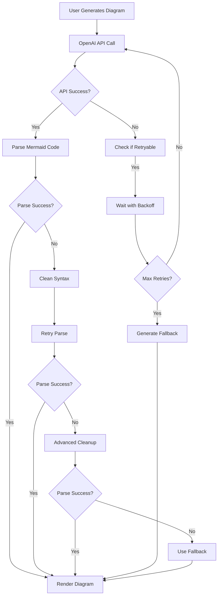

# Mermaid Diagram Error Handling & Retry System

## Overview
Comprehensive error handling and retry system implemented to address Mermaid diagram parsing errors and ensure reliable diagram generation.

## Components Enhanced

### 1. **MermaidViewer Component** (`src/components/MermaidViewer/MermaidViewer.tsx`)
- **Exponential backoff retry** (up to 3 attempts)
- **Advanced syntax cleanup** before parsing
- **Real-time retry status** with progress indicators  
- **Smart fallback generation** when all retries fail
- **Enhanced error messages** with user-friendly suggestions

### 2. **OpenAI Service** (`src/services/azure/OpenAIService.ts`)
- **Enhanced prompts** with specific Mermaid syntax rules and examples
- **Retry mechanism** for API failures (3 attempts with jitter)
- **Advanced syntax validation** and cleanup
- **Fallback diagram generation** when AI generation fails completely
- **Error categorization** (retryable vs non-retryable)

### 3. **Processing Pipeline** (`src/services/ProcessingPipeline.ts`)
- **Retry logic** for diagram generation failures
- **Smart error analysis** using centralized error handling
- **Configurable retry attempts** with exponential backoff

### 4. **Error Handling Utilities** (`src/utils/errorHandling.ts`)
- **Error categorization** (Network, Parsing, API, Timeout, Auth, Unknown)
- **User-friendly error messages** with actionable suggestions
- **Smart retry delay calculation** based on error type
- **Progress tracking** and retry statistics

### 5. **Mermaid Utilities** (`src/utils/mermaidUtils.ts`)
- **Content analysis** to determine appropriate diagram types
- **Fallback diagram generation** for different content types
- **Advanced syntax validation** and cleanup
- **Template generation** for conversation, process, and decision flows

## Error Handling Flow



## Key Features

### **Smart Error Recovery**
- Automatically detects and fixes common Mermaid syntax errors
- Progressive cleanup attempts with increasing aggressiveness
- Context-aware fallback generation based on content analysis

### **User Experience**
- Real-time retry status with attempt counters
- User-friendly error messages with actionable suggestions
- Progress indicators showing retry reasons and timing

### **Robust Retry Logic**
- Exponential backoff with jitter to prevent thundering herd
- Error type analysis to determine retry worthiness
- Different retry strategies for different error types

### **Fallback Safety Net**
- Smart content analysis (conversation, process, decision)
- Template-based diagram generation as last resort
- Ensures users always get a diagram, even if simplified

## Error Types Handled

| Error Type | Retry Strategy | Fallback Action |
|------------|---------------|-----------------|
| **Network** | 2s base delay, exponential backoff | API retry → Fallback |
| **Parsing** | 1s base delay, quick retry | Syntax cleanup → Fallback |
| **API Rate Limit** | 3s base delay, longer backoff | Wait → Retry → Fallback |
| **Timeout** | 5s base delay, extended wait | Retry with shorter timeout |
| **Authentication** | No retry | Immediate user guidance |

## Recent Improvements (Latest Commits)

### **Commit 74f5023**: Basic Retry Mechanisms
- Implemented retry logic across all services
- Added exponential backoff and user feedback
- Enhanced error categorization and handling

### **Commit 0895f68**: Enhanced Prompts & Validation
- Improved OpenAI prompts with specific syntax rules
- Added automatic syntax cleanup and validation
- Enhanced error messages with examples

### **Commit 206b30b**: Comprehensive Fallback System
- Created smart fallback diagram generation
- Added content analysis for appropriate diagram types
- Implemented safety net ensuring users always get diagrams

## Testing

The system is designed to handle the specific error you encountered:
```
Parse error on line 2: ...arc TD A[User: "Hey, are you able to... 
Expecting 'SOE', 'DOUBLECIRCLEND', 'E', '-)', 'STADIUMEND'...
```

**Resolution Flow:**
1. **Detect** parsing error with "arc" and quote issues
2. **Clean** syntax by removing "arc" keywords and fixing quotes  
3. **Retry** with cleaned syntax
4. **Fallback** to template-based diagram if still failing
5. **Display** user-friendly error with suggestions

## Future Enhancements

- **A/B testing** of different prompt strategies
- **Machine learning** from successful diagram patterns
- **User feedback** integration for prompt improvement
- **Advanced content analysis** for better diagram type detection
