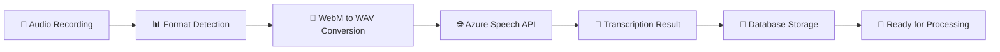
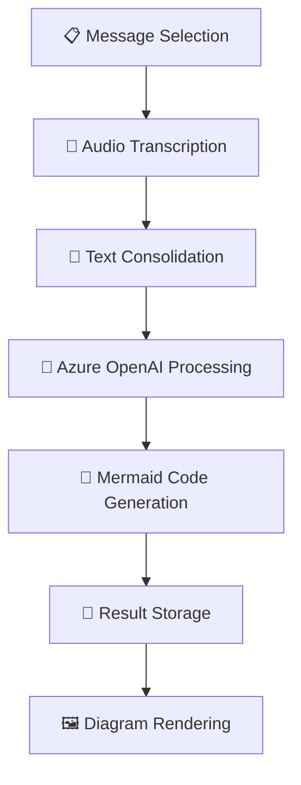
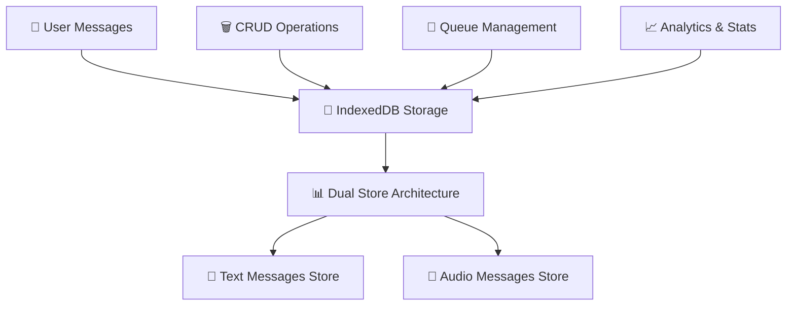

# AcceptiCon - AI-Powered Mermaid Diagram Generator

A Progressive Web Application that converts text and voice messages into interactive Mermaid diagrams using Azure AI services.

## � Design System

AcceptiCon features a **NotebookLM-inspired design** with clean, modern aesthetics:

- **Color Palette**: Light theme with `#EDEFFA` background and white cards
- **Typography**: Roboto font family with consistent sizing and weights
- **Layout**: Card-based design with 12px border radius and subtle shadows
- **Components**: Material Design 3 inspired buttons and form elements
- **Responsive**: Mobile-first approach with adaptive grid layouts

## �🏗️ High-Level Architecture

AcceptiCon follows a modular, pipeline-based architecture that processes user inputs through multiple stages to generate intelligent diagrams:

```
┌─────────────────┐    ┌──────────────────┐    ┌─────────────────┐
│   User Input    │    │  Processing      │    │   Diagram       │
│  (Text/Voice)   │───▶│   Pipeline       │───▶│  Generation     │
└─────────────────┘    └──────────────────┘    └─────────────────┘
        │                        │                        │
        ▼                        ▼                        ▼
┌─────────────────┐    ┌──────────────────┐    ┌─────────────────┐
│   Storage       │    │  Azure Services  │    │   Visualization │
│  (IndexedDB)    │    │ Speech + OpenAI  │    │   (Mermaid.js)  │
└─────────────────┘    └──────────────────┘    └─────────────────┘
```

## 🔧 Core Components

### 1. **Frontend Layer**
- **React + TypeScript**: Modern UI with type safety and NotebookLM-inspired design
- **Vite**: Fast development and optimized builds
- **Progressive Web App**: Offline capabilities and native app experience

### 2. **Input Management**
- **Text Input**: Direct message entry with Material Design 3 styling
- **Voice Recording**: Real-time audio capture with MediaRecorder API
- **Message Storage**: Persistent storage using IndexedDB

### 3. **Processing Pipeline**
- **Speech-to-Text**: Azure Speech Services for audio transcription
- **Content Analysis**: Azure OpenAI for intelligent diagram generation
- **Queue Management**: Background processing with retry mechanisms

### 4. **Visualization Engine**
- **Mermaid.js**: Dynamic diagram rendering in clean card interface
- **Interactive Controls**: Zoom, pan, download capabilities with Material Design buttons
- **Multiple Format Support**: Flowcharts, sequence diagrams, etc.

## 🚀 Pipeline Workflows

### Speech Recognition Pipeline



**Key Features:**
- **Multi-format Support**: Automatic WebM to WAV conversion for optimal Azure compatibility
- **Real-time Processing**: Single recognition mode for short audio clips
- **Quality Optimization**: 16kHz mono recording for speech clarity
- **Error Handling**: Comprehensive error detection and recovery

### Diagram Generation Pipeline



**Process Flow:**
1. **Input Aggregation**: Collect selected text and audio messages
2. **Sequential Transcription**: Convert all audio to text using optimized Azure Speech
3. **Content Synthesis**: Combine all text content for analysis
4. **AI Processing**: Generate appropriate Mermaid diagram code via Azure OpenAI (fresh call every time)
5. **Result Storage**: Store results for reference (no cache checking on generation)
6. **Visualization**: Render interactive diagrams with Mermaid.js

### Data Management Pipeline



**Storage Strategy:**
- **Dual Store Design**: Separate stores for text and audio messages
- **Blob Storage**: Efficient audio file storage within IndexedDB
- **Metadata Indexing**: Fast retrieval using timestamp and type indexes
- **Cleanup Policies**: Automatic old data removal with configurable retention

## 📁 Project Structure

```
src/
├── components/           # React UI components
│   ├── common/          # Shared components (MessageComponent)
│   ├── ConfigurationPanel/  # Azure service configuration
│   ├── InputPanel/      # Message input and recording
│   ├── Layout/          # Application layout
│   ├── MermaidViewer/   # Diagram visualization
│   └── ViewerPanel/     # Results display
├── services/            # Business logic and external integrations
│   ├── audio/          # Audio recording and processing
│   ├── azure/          # Azure Speech and OpenAI services
│   ├── storage/        # IndexedDB data management
│   ├── ProcessingPipeline.ts  # Main processing orchestration
│   └── ProcessingQueue.ts     # Background task management
├── hooks/              # Custom React hooks
│   ├── useMessages.ts  # Message CRUD operations
│   ├── useProcessingPipeline.ts  # Pipeline state management
│   └── useNetworkStatus.ts      # Connectivity monitoring
├── contexts/           # React context providers
├── types/             # TypeScript type definitions
└── utils/             # Utility functions
```

## 🔄 State Management

### Processing Pipeline Context
- **Centralized State**: Single source of truth for processing status
- **Real-time Updates**: Progress tracking and error handling
- **Queue Management**: Background task coordination

### Message Management
- **Local State**: React state for immediate UI updates
- **Persistent Storage**: IndexedDB for data persistence
- **Sync Operations**: Database and UI state synchronization

## 🛠️ Azure Integration

### Speech Services Configuration
```typescript
{
  subscriptionKey: "YOUR_AZURE_SPEECH_KEY",
  region: "eastus2",
  language: "en-US",
  optimizations: {
    sampleRate: 16000,
    channels: 1,
    format: "wav"
  }
}
```

### OpenAI Services Configuration
```typescript
{
  apiKey: "YOUR_AZURE_OPENAI_KEY",
  endpoint: "https://your-endpoint.cognitiveservices.azure.com",
  deployment: "gpt-5-chat",
  apiVersion: "2023-12-01-preview"
}
```

## 🚦 Error Handling & Recovery

### Multi-Layer Error Handling
1. **Service Level**: Azure API error detection and retry logic
2. **Pipeline Level**: Processing failure recovery and fallbacks
3. **UI Level**: User-friendly error messages and manual retry options
4. **Storage Level**: Data integrity checks and cleanup procedures

### Debugging Tools
- **Development Mode**: Service exposure for console debugging
- **Debug Scripts**: Comprehensive testing utilities (`debug-speech.js`)
- **Logging**: Detailed operation tracking throughout pipelines

## 🔧 Development Setup

### Prerequisites
- Node.js 18+
- Azure Speech Services subscription
- Azure OpenAI subscription

### Environment Configuration
Create `.env` file:
```env
VITE_AZURE_SPEECH_KEY=your_speech_key
VITE_AZURE_SPEECH_REGION=your_region
VITE_AZURE_OPENAI_ENDPOINT=your_openai_endpoint
VITE_AZURE_OPENAI_KEY=your_openai_key
VITE_AZURE_OPENAI_DEPLOYMENT=your_deployment_name
```

### Installation & Running
```bash
npm install
npm run dev     # Development server
npm run build   # Production build
```

### Testing Speech Pipeline
```javascript
// In browser console (development mode)
window.debugSpeech.runAllTests()
window.debugSpeech.testCompleteAudioPipeline()
```

## 🎯 Performance Optimizations

- **Fresh Generation**: Always calls OpenAI API to ensure latest diagram generation techniques
- **Queue Processing**: Background task execution to maintain UI responsiveness
- **Audio Optimization**: Format conversion and quality settings for speech recognition
- **Lazy Loading**: Dynamic imports for large dependencies
- **PWA Features**: Service worker for offline functionality
- **Result Storage**: Diagram results stored for reference (not used for cache bypassing)

## 🔮 Future Enhancements

- **Multi-language Support**: Additional language support for speech recognition
- **Advanced Diagram Types**: Support for more Mermaid diagram varieties
- **Collaboration Features**: Real-time diagram sharing and editing
- **Template System**: Pre-built diagram templates for common use cases
- **Export Options**: Additional export formats (PDF, PNG, SVG)

## 📄 License

This project is licensed under the MIT License - see the [LICENSE](LICENSE) file for details.
